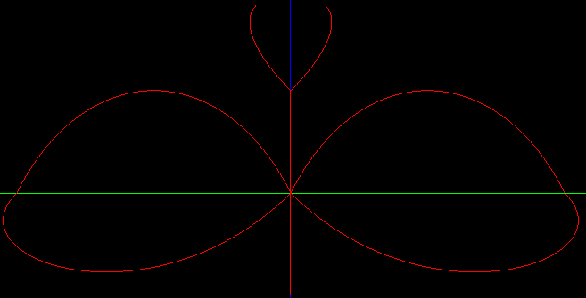

# Projeto 1 CG

### _Projeto em `OpenGL` sobre Curvas de Bézier na disciplina da Universidade: `Computação Gráfica`_

</img>

## 👁️Tutorial Para Visualizar

1. Clique [aqui](https://sal0minh0.github.io/projeto1_CG/) 👈
2. Clique `duas vezes` na tela do site e estará no `FullScreen`
3. Aperte `"p"` e vc visualizará o polígono de controle
4. Aperte `"Espaço"` continuamente e vc visualizará as transformações (Com a ordem Translação, Rotação e Escala)
5. Aperte `"Esc"` e vc sairá do programa ou `"Q"` (Não funciona na versão Web)

## 🤓O que esse código faz?

- **_É um visualizador interativo de curvas de Bézier_** 📈   
- **_Feito em [C ++](https://cplusplus.com/)_** 👨‍💻  
- **_Usando [OpenGL ES 3.0](https://www.khronos.org/opengles/) com [GLFW](https://www.glfw.org/) e [Emscripten](https://emscripten.org) (Para versão Web)._** 🪟

## 🧐A funcionalidade principal do programa:

- Inclui carregar curvas de um arquivo .obj;
- Aplicar 3 transformações geométricas (Translação (t), Rotação (r) e Escala (s));
- E exibi-las com suporte a visualização em tempo real.

## 📄Arquivo .obj

|         `"v"`         |         `"c"`         |              `"t/r/s"`               |
| :-------------------: | :-------------------: | :----------------------------------: |
| Coordenadas de pontos | Inicia uma nova curva | Define as transformações geométricas |

[Comentário]: <> (Estilos para a Imagem)

